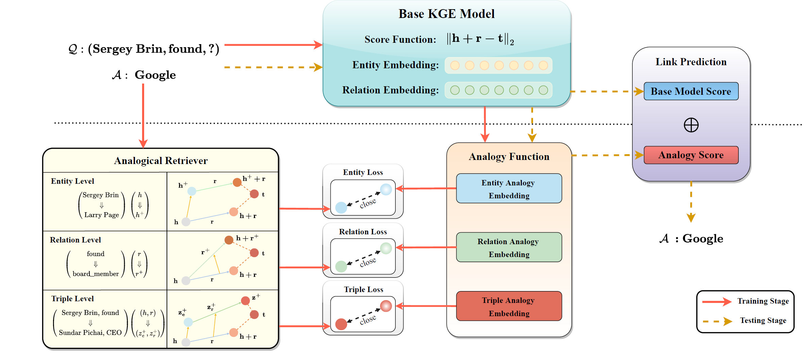

# AnKGE
### This repository contains code for:
 - *[Analogical Inference Enhanced Knowledge Graph Embedding](https://arxiv.org/abs/2301.00982)* (AAAI 2023)

## Abstract
We propose a novel and general self-supervised framework AnKGE to enhance KGE models with analogical inference capability. First, we retrieve appropriate analogical objects from entity-level, relation-level, and triple level. Second, we train an analogy function for each level of analogical inference with the original element embedding from a well-trained KGE model as input, which outputs the analogical object embedding. Finally, in order to combine direct inference capability from the original KGE model and analogical inference capability enhanced by AnKGE, we interpolate the analogy score with the base model score. Through extensive experiments on FB15k-237 and WN18RR datasets, AnKGE remakes the rank of hard-predicted triples in the base model by analogical inference, achieving competitive results in the link prediction task.

## Model Architecture


## Dependencies

- ```Python 3```
- ```ipython==8.4.0```
- ```numpy==1.19.5```
- ```pytorch_lightning==1.5.10```
- ```PyYAML==6.0```
- ```requests==2.25.1```
- ```torch==1.8.0+cu111```
- ```tqdm==4.61.2```
- ```wandb==0.12.21```
- All experiments are performed with one RTX 3090 GPU.


## Usage
- `src/`:
    - `ankge/`: include AnKGE codes.
- `dataset/`: 
    - `dataset/FB15K237/`: FB15k-237 dataset resources
    - `dataset/WN18RR/`: WN18RR dataset resources
- `output/`: 
    - `output/link_prediciton/FB15K237/`: model outputs for FB15k-237 dataset
    - `output/link_prediciton/WN18RR/`: model outputs for WN18RR dataset
- `logging/`: include train logging files.
- `scripts/`: include train shell files.

## Training and Testing

**Step1** Create a virtual environment using ```Anaconda``` and enter it
```bash
conda create -n ankge python=3.8
conda activate ankge
```

**Step2** Install package
```bash
pip install -r requirements.txt
```

**Step3** Train and test base model
```bash
# FB15k-237
sh scripts/FreeBase/TransE_Rev_FB.sh
sh scripts/FreeBase/RotatE_Rev_FB.sh
sh scripts/FreeBase/HAKE_Rev_FB.sh
sh scripts/FreeBase/PairRE_Rev_FB.sh
```

```bash
# WN18RR
sh scripts/WordNet/TransE_Rev_WN.sh
sh scripts/WordNet/RotatE_Rev_WN.sh
sh scripts/WordNet/HAKE_Rev_WN.sh
sh scripts/WordNet/PairRE_Rev_WN.sh
```

**Step4** Train and test AnKGE with base model
```bash
# FB15k-237
sh scripts/FreeBase/AnKnn_TransE_Rev_FB.sh
sh scripts/FreeBase/AnKnn_RotatE_Rev_FB.sh
sh scripts/FreeBase/AnKnn_HAKE_Rev_FB.sh
sh scripts/FreeBase/AnKnn_PairRE_Rev_FB.sh
```
```bash
# WN18RR
sh scripts/WordNet/AnKnn_TransE_Rev_WN.sh
sh scripts/WordNet/AnKnn_RotatE_Rev_WN.sh
sh scripts/WordNet/AnKnn_HAKE_Rev_WN.sh
sh scripts/WordNet/AnKnn_PairRE_Rev_WN.sh
```

**Note**: 
- Default `.sh` files have been set the best hyperparameters, you can open the `.sh` file for parameter</a> modification.
- Before training AnKGE with base model, please make sure the path of base model is correct on `BASE_MODEL_PATH`.

## Cite:
Please condiser citing this paper if you use the ```code``` or ```data``` from our work.

Thanks a lot : )

```
@InProceedings{AnKGE,
    author    = {Yao Zhen, 
                 Zhang Wen, 
                 Chen Mingyang, 
                 Huang Yufeng, 
                 Yang Yi and
                 Chen Huajun},
    title     = {Analogical Inference Enhanced Knowledge Graph Embedding},
    booktitle = {Proceedings of the Thirty-Seventh AAAI Conference on Artificial Intelligence (AAAI)},
    year      = {2023}
}
```